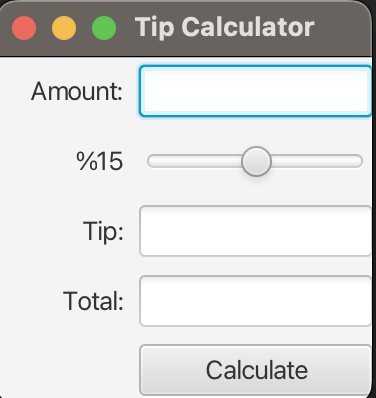
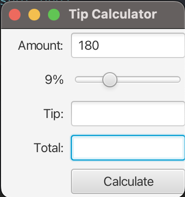
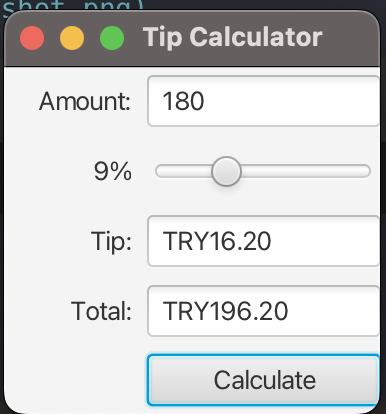

# Tip Calculator

A simple and user-friendly tip calculation application developed using JavaFX.

## Features

- Takes input amount for calculation
- Adjust tip percentage with slider (range 0%-30%)
- Automatically calculates tip amount and total
- Currency formatting
- Error handling

## Technologies

- Java
- JavaFX
- FXML
- SceneBuilder

## How It Works

1. Enter the payment amount
2. Adjust tip percentage using the slider (default 15%)
3. Click the "Calculate" button
4. Tip amount and total will be automatically calculated

## Application Flow

### 1. Initial State

The initial state of the Tip Calculator application. The interface shows empty input fields with a default tip percentage of 15%.

### 2. Input Phase

User entering the amount (180) and adjusting the tip percentage to 9% using the slider. Ready to calculate the tip and total amount.

### 3. Calculation Result

Final calculation results showing:
- Input Amount: 180 TRY
- Selected Tip: 9%
- Tip Amount: 16.20 TRY
- Total Amount: 196.20 TRY
